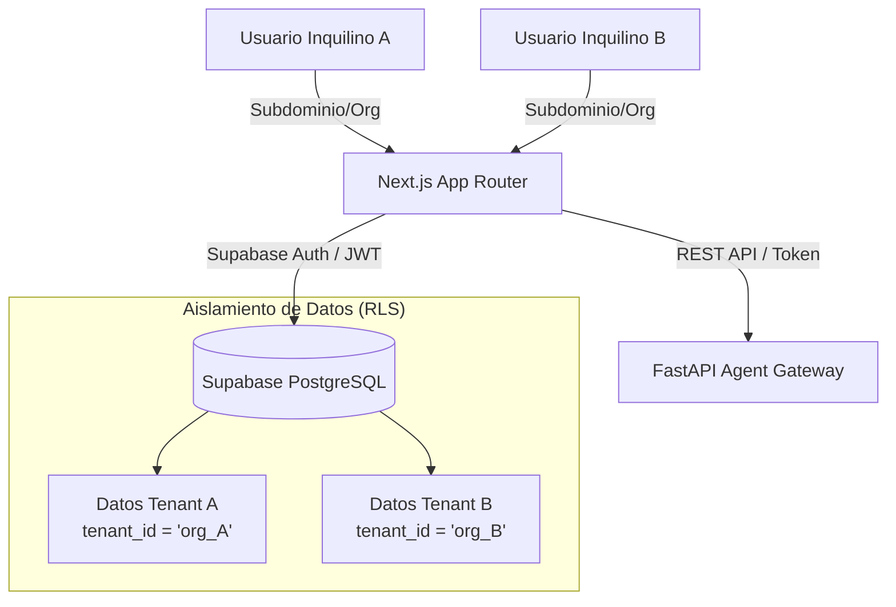

# ARIA-OS: SaaS Packaging and Multi-Tenancy Architecture Plan

Este documento describe la arquitectura técnica, las modificaciones de código y la infraestructura necesarias para empaquetar ARIA-OS y transformarlo de un dashboard local monousuario a una plataforma SaaS (Software as a Service) multi-inquilino (multi-tenant) lista para producción.

---

## 1. Diseño de Arquitectura Multi-Tenant

Para ofrecer ARIA-OS como un servicio SaaS, utilizaremos un modelo de **Base de Datos Compartida con Aislamiento Lógico** mediante **Row-Level Security (RLS)** en Supabase. Es la opción más escalable y de menor costo operativo.



---

## 2. Cambios Requeridos en Base de Datos (Supabase)

### A. Nuevas Tablas del Sistema SaaS

Crearemos un esquema centralizado para administrar inquilinos, suscripciones y credenciales:

```sql
-- 1. Tabla de Tenants (Inquilinos/Organizaciones)
CREATE TABLE tenants (
    id UUID PRIMARY KEY DEFAULT gen_random_uuid(),
    name VARCHAR(255) NOT NULL,
    slug VARCHAR(255) UNIQUE NOT NULL,
    created_at TIMESTAMP WITH TIME ZONE DEFAULT timezone('utc'::text, now()) NOT NULL,
    subscription_tier VARCHAR(50) DEFAULT 'free' NOT NULL, -- 'free', 'pro', 'enterprise'
    subscription_status VARCHAR(50) DEFAULT 'active' NOT NULL -- 'active', 'past_due', 'canceled'
);

-- 2. Credenciales e Integraciones por Tenant (Encriptadas)
CREATE TABLE tenant_integrations (
    id UUID PRIMARY KEY DEFAULT gen_random_uuid(),
    tenant_id UUID REFERENCES tenants(id) ON DELETE CASCADE NOT NULL,
    woo_url VARCHAR(255),
    woo_consumer_key TEXT,         -- Encriptado con pgsodium o vault
    woo_consumer_secret TEXT,      -- Encriptado con pgsodium o vault
    google_sheet_id VARCHAR(255),
    google_orders_gid INT,
    google_products_gid INT,
    google_suppliers_gid INT,
    created_at TIMESTAMP WITH TIME ZONE DEFAULT timezone('utc'::text, now()) NOT NULL,
    UNIQUE(tenant_id)
);
```

### B. Modificación de Tablas Existentes
Debemos añadir la columna `tenant_id` a todas las tablas del negocio:
*   `products`
*   `daily_inventory_ledger`
*   `purchase_order_drafts`
*   `supplier_catalog`
*   `wc_orders_cache`
*   `aria_proposals`
*   `aria_proposals_comments`

### C. Habilitación de RLS (Row Level Security)
Para cada una de las tablas del negocio, forzaremos políticas basadas en la sesión del usuario:
```sql
ALTER TABLE wc_orders_cache ENABLE ROW LEVEL SECURITY;

CREATE POLICY tenant_isolation_policy ON wc_orders_cache
    FOR ALL
    TO authenticated
    USING (tenant_id = (auth.jwt() ->> 'tenant_id')::uuid)
    WITH CHECK (tenant_id = (auth.jwt() ->> 'tenant_id')::uuid);
```

---

## 3. Cambios en el Backend (FastAPI / ADK)

### A. Desacoplamiento de Variables de Entorno monousuario
Actualmente, las credenciales se leen directamente de `.env`. En el SaaS, el agente debe **recibir el `tenant_id`** en la cabecera de la petición REST, consultar las credenciales de ese tenant en Supabase, y usarlas dinámicamente para ese hilo de ejecución.

Modificación en `src/infra/db.py`:
```python
# Crear clientes de Supabase con el esquema del tenant autenticado
def get_supabase_client_for_tenant(tenant_jwt: str):
    # Retorna un cliente con el token JWT del inquilino,
    # asegurando que todas las consultas respeten las políticas RLS.
    pass
```

### B. Aislamiento en el Sandbox y el ADK Runner
En [main.py](file:///c:/dashboard/intelligence-agent/src/main.py#L121), incluiremos el `tenant_id` y el `user_id` dentro del `session_service` y el estado de ADK.
Cualquier consulta ejecutada por el agente mediante `execute_safe_read_query` usará las credenciales del inquilino y estará acotada por RLS.

---

## 4. Cambios en el Frontend (Next.js)

### A. Autenticación y Multi-inquilino (Multi-tenant Routing)
1.  **Supabase Auth**: Activación de usuarios, login y recuperación de contraseñas.
2.  **Middlewares de Organización**: Almacenar el `tenant_id` en los claims del JWT (metadatos del usuario de Supabase) para que se envíe automáticamente en cada petición de API o acción del servidor.

### B. Configuración de la Integración (Panel de Ajustes SaaS)
Crear una página de Configuración en el dashboard Next.js (`app/(dashboard)/settings/page.tsx`) que permita al administrador de la cuenta:
*   Conectar su WooCommerce (ingresar URL, Consumer Key y Consumer Secret).
*   Configurar el ID de su Google Sheet para el fallback de sincronización.

---

## 5. Sincronización Automatizada (SaaS Background Sync)

La ruta actual de sincronización `/api/v1/sync-stock` es monousuario. En un SaaS:
1.  Un script cron (ej. ejecutado cada 15 min por Vercel Cron o un worker de Node) consultará la lista de tenants activos.
2.  Para cada tenant, leerá sus credenciales e invocará el pipeline de sincronización de stock pasándole su identificador.
3.  Implementación de colas (Queue Manager como BullMQ o Upstash Workflow) para procesar múltiples sincronizaciones de forma concurrente sin agotar la memoria o sobrepasar tiempos de ejecución (timeouts).

---

## 6. Billing y Subscriptions (Monetización)

1.  **Stripe Billing Portal**: Integración mediante webhooks de Stripe.
2.  **Tier Limits (Cuotas)**:
    *   **Free Plan**: Límite de 20 consultas del agente al día y sincronización de inventario cada 24 horas.
    *   **Pro Plan**: Consultas ilimitadas del agente, sincronización cada hora y alertas de reorden proactivas.
    *   **Enterprise Plan**: Soporte para múltiples tiendas de WooCommerce en un solo tenant y exportación de PDFs ilimitada.

---

## 7. Plan de Empaquetado e Infraestructura (Docker)

Crearemos un archivo `docker-compose.yml` para levantar todo el stack localmente o en un VPS fácilmente.

### `[NEW]` [docker-compose.yml](file:///c:/dashboard/docker-compose.yml)
```yaml
version: '3.8'

services:
  frontend:
    build:
      context: ./
      dockerfile: Dockerfile.frontend
    ports:
      - "3000:3000"
    environment:
      - NEXT_PUBLIC_SUPABASE_URL=https://your-project.supabase.co
      - NEXT_PUBLIC_SUPABASE_ANON_KEY=your-anon-key
    depends_on:
      - backend

  backend:
    build:
      context: ./intelligence-agent
      dockerfile: Dockerfile
    ports:
      - "8000:8000"
    environment:
      - SUPABASE_URL=https://your-project.supabase.co
      - SUPABASE_SERVICE_KEY=your-service-role-key
      - GEMINI_API_KEY=AIzaSy...
      - GEMINI_API_KEY_2=AIzaSy...
```

---

## Plan de Verificación de Fases SaaS

### Fase 1: Base de Datos y RLS (Aislamiento)
*   [ ] Modificar esquema en Supabase agregando `tenant_id` y activar políticas RLS en `wc_orders_cache`.
*   [ ] Comprobar que una consulta de un usuario del Inquilino A no pueda ver registros del Inquilino B.

### Fase 2: Configuración Dinámica de Tienda (WooCommerce)
*   [ ] Crear API en Next.js para guardar credenciales de WooCommerce en `tenant_integrations`.
*   [ ] Modificar la sincronización para cargar las credenciales dinámicas de WooCommerce desde base de datos.

### Fase 3: Pasarela de Pagos (Suscripciones)
*   [ ] Vincular login de Supabase con webhooks de Stripe para activar/pausar suscripciones.
